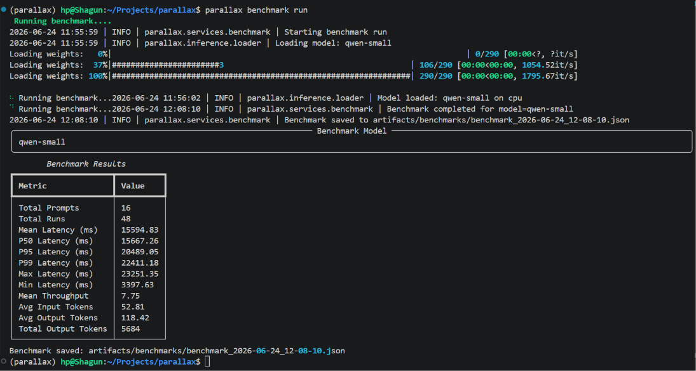
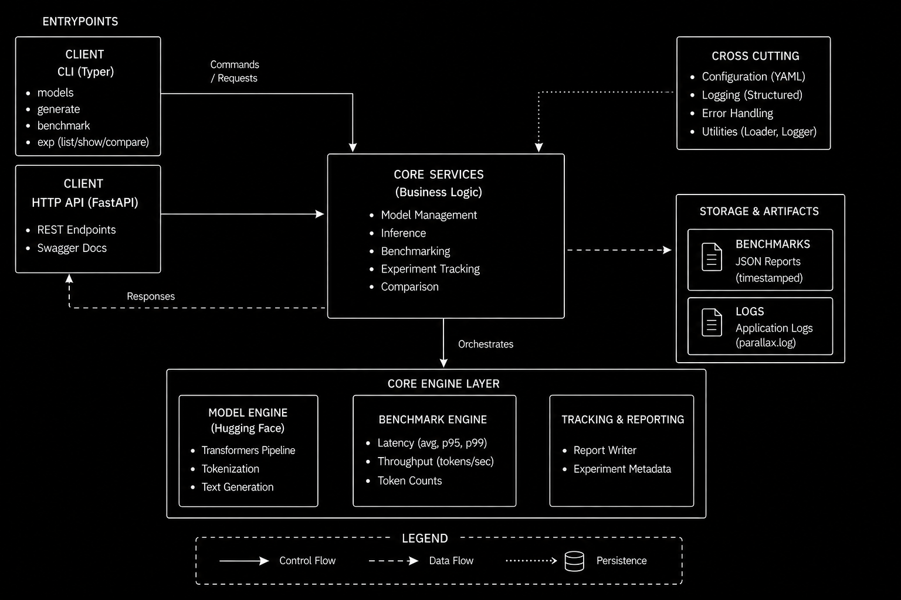

# Parallax
```text
8888888b.                          888 888                  
888   Y88b                         888 888                  
888    888                         888 888                  
888   d88P 8888b.  888d888 8888b.  888 888  8888b.  888  888
8888888P"     "88b 888P"      "88b 888 888     "88b `Y8bd8P'
888       .d888888 888    .d888888 888 888 .d888888   X88K  
888       888  888 888    888  888 888 888 888  888 .d8""8b.
888       "Y888888 888    "Y888888 888 888 "Y888888 888  888
```

>A local platform for serving, benchmarking, and comparing large language models.


---

## Table of Contents

- [Why Parallax](#why-parallax)
- [Overview](#overview)
- [Key Features](#key-features)
- [Architecture](#architecture)
- [Installation](#installation)
- [Configuration](#configuration)
- [Usage](#usage)
  - [CLI](#cli)
  - [REST API](#rest-api)
- [Runtime Artifacts](#runtime-artifacts)
- [Project Structure](#project-structure)
- [Benchmarks & Experiment Tracking](#benchmarks--experiment-tracking)
- [Testing](#testing)
- [Supported Models](#supported-models)
- [V1 Scope & Limitations](#v1-scope--limitations)
- [License](#license)

---

## Why Parallax

Most LLM projects begin and end in notebooks. While notebooks are useful for experimentation, they reveal little about how AI systems are structured beyond the model itself: how requests flow through a system, how services are organized, how experiments are tracked, and how results remain reproducible over time.

Parallax was built to explore those engineering concerns in practice. Instead of focusing on model training, it focuses on the infrastructure surrounding AI systems: model serving, benchmarking, experiment tracking, configuration management, and layered system design.

The result is a platform that is deliberately over-engineered for local use, not because local use requires it, but because engineering is the point. The goal is to understand and implement the architectural patterns commonly found in production-oriented AI systems.



---

## Overview

Parallax is a modular local LLM platform built around a production-inspired service architecture.

It exposes two interfaces over a shared service layer.

 The CLI provides full platform access: model management, text generation, benchmark execution, and experiment tracking. 

The FastAPI layer exposes a focused subset: model management and inference through a typed HTTP interface with Swagger documentation.

Benchmarking and experiment tracking are CLI-driven workflows. Results are persisted as structured JSON artifacts and can be loaded, inspected, and compared across runs.

---

## Key Features

**Model Management**
- List available models from configuration
- View and switch the active model at runtime
- Persistent model state across commands

**Text Generation**
- Run inference via CLI or HTTP
- Per-request metrics: generation latency, throughput (tokens/sec) , input/output token counts

**Benchmarking**
- Execute structured benchmark runs against any configured model
- Collect generation latency (decode loop), throughput, and token-level statistics
- Percentile breakdown: mean, p50, p95, p99, min, max

**Experiment Tracking**
- Auto-save benchmark runs as timestamped JSON artifacts
- Load and inspect historical reports
- Side-by-side comparison across runs or models

**REST API**
- FastAPI serving layer with typed request/response schemas
- Model management and inference endpoints
- Swagger UI at `/docs`

**Observability**
- Structured logging to `artifacts/logs/`
- Reproducible benchmark artifacts with full run metadata
- Configuration-driven; all behavior controlled from a single YAML file

---

## Architecture

Parallax follows a layered architecture that separates interfaces, business logic, model execution, and artifact persistence.

Key design principles:

- Shared service layer across CLI and FastAPI: business logic is implemented once
- Separated concerns - inference, benchmarking, and tracking are independent modules
- Configuration-driven model management: models and behavior defined in `config/settings.yaml`
- Structured logging and artifact persistence ensure that benchmark runs remain traceable.



For a detailed breakdown of each layer and component, see [`docs/architecture.md`](docs/architecture.md).

---

## Installation

**Requirements:** Python 3.10+

```bash
git clone https://github.com/Shagun812/parallax.git
cd parallax

python -m venv .venv
# Linux / macOS / WSL
source .venv/bin/activate   

# Windows
.venv\Scripts\Activate.ps1   

# For runtime dependencies
pip install -e .

# For runtime dependencies + testing tools
pip install -e ".[dev]"
```

---

## Configuration

Parallax is configuration-driven. All models, inference parameters, benchmark settings, and logging behavior are controlled from a single file:

```
config/settings.yaml
```

**Example configuration:**

```yaml
project:
  name: parallax
  artifacts_dir: "./artifacts"

models:
  qwen-small:
    path: "Qwen/Qwen2.5-0.5B-Instruct"
    type: "causal_lm"
  smollm2:
    path: "HuggingFaceTB/SmolLM2-360M-Instruct"
    type: "causal_lm"

inference:
  default_model: "qwen-small"
  device: "auto"
  max_new_tokens: 126
  do_sample: true
  temperature: 0.4
  top_p: 0.9
  repetition_penalty: 1.15

benchmark:
  prompt_file: data/prompts.json
  runs_per_model: 3
  warmup_runs: 1
  collect_latency: true
  collect_memory: false
  collect_throughput: true

quality:
  enabled: false
  method: "semantic_similarity"
  embedding_model: "all-MiniLM-L6-v2"
  collect_coherence_score: true

logging:
  enabled: true
  level: "INFO"
```

**Configuration reference:**

| Section | Key | Description |
|---|---|---|
| `project` | `artifacts_dir` | Root directory for all runtime artifacts |
| `models` | `path` | HuggingFace model identifier |
| `models` | `type` | Model class - currently `causal_lm` |
| `inference` | `default_model` | Model loaded on startup |
| `inference` | `device` | `auto`, `cuda`, or `cpu` |
| `inference` | `max_new_tokens` | Maximum decode tokens per request |
| `inference` | `temperature` | Sampling temperature |
| `inference` | `top_p` | Nucleus sampling threshold |
| `inference` | `repetition_penalty` | Penalizes token repetition |
| `benchmark` | `prompt_file` | Path to benchmark prompt dataset |
| `benchmark` | `runs_per_model` | Benchmark iterations per run |
| `benchmark` | `warmup_runs` | Warmup iterations excluded from metrics |
| `quality` | `enabled` | Enable semantic quality scoring (v2) |
| `logging` | `level` | Log verbosity : `INFO`, `DEBUG`, `WARNING` |

---

## Usage

### CLI

**Model management**

```bash
# List all configured models
parallax models list

# Show the currently active model
parallax models current

# Switch active model
parallax models switch -m smollm2
```

**Text generation**

```bash
parallax generate -p "Explain attention mechanisms"
```

Output includes: generated text, input tokens, output tokens, generation latency (ms), tokens/sec.

**Benchmarking**

```bash
parallax benchmark run
```

Runs a structured benchmark workload against the active model using prompts from `data/prompts.json`. Results are automatically saved to `artifacts/benchmarks/`.

**Experiment tracking**

```bash
# List all saved benchmark reports
parallax exp list

# Inspect a specific report
parallax exp show -f <filename>

# Compare two runs side by side
parallax exp compare -a <file1> -b <file2>
```
### Command Aliases

| Full Command | Alias  |
|-------------|---------|
| `benchmark` | `bench` |
| `experiments` | `exp` |


### Quick Flags Reference

| Option | Short | Description |
|----------|--------|-------------|
| `--model` | `-m` | Model name to switch  |
| `--prompt` | `-p` | Input prompt for text generation |
| `--file` | `-f` | Benchmark report filename |
| `--file-a` | `-a` | First benchmark report for comparison |
| `--file-b` | `-b` | Second benchmark report for comparison |
---

### REST API

Start the server:

```bash
uvicorn api.app:app --reload
```

Swagger UI: `http://127.0.0.1:8000/docs`

**Endpoints**

| Method | Endpoint | Description |
|---|---|---|
| `GET` | `/health` | Health check |
| `GET` | `/models` | List available models |
| `GET` | `/models/current` | Show active model |
| `POST` | `/models/switch` | Switch active model |
| `POST` | `/generate` | Run inference |

**Example requests**

```bash
# Generate text
curl -X POST http://127.0.0.1:8000/generate \
  -H "Content-Type: application/json" \
  -d '{"prompt": "Explain attention mechanisms"}'

# Switch model
curl -X POST http://127.0.0.1:8000/models/switch \
  -H "Content-Type: application/json" \
  -d '{"model_name": "smollm2"}'
```

---

## Runtime Artifacts

Parallax generates artifacts at runtime. These are excluded from version control via `.gitignore` and created automatically on first use.

```
artifacts/
├── benchmarks/
│   ├── benchmark_2026-06-23_18-20-01.json
│   └── benchmark_2026-06-23_18-45-17.json
└── logs/
    └── parallax.log
```

Benchmark artifacts contain full run metadata: model name, timestamp, latency distributions, throughput metrics, and token statistics. Logs are written in structured format for traceability.

---

## Project Structure

```text
parallax/

├── api/
│   ├── app.py                     # FastAPI application and route definitions
│   └── schemas.py                 # Pydantic request/response schemas
│
├── benchmark/
│   ├── comparator.py              # Benchmark comparison logic
│   ├── metrics.py                 # Latency and throughput calculations
│   ├── quality.py                 # Quality evaluation module (future use)
│   └── runner.py                  # Benchmark execution engine
│
├── cli/
│   └── main.py                    # Typer CLI commands
│
├── config/
│   └── settings.yaml              # Centralized project configuration
│
├── data/
│   └── prompts.json               # Benchmark prompt dataset
│
├── docs/
│   ├── architecture.md            # System architecture documentation
│   ├── architecture.png           # Architecture diagram
│   └── CLI.png                    # CLI screenshots and usage examples
│
├── inference/
│   ├── generator.py               # Text generation pipeline
│   └── loader.py                  # Model and tokenizer loading
│
├── services/
│   ├── benchmark.py               # Benchmark workflow orchestration
│   ├── export.py                  # Report and artifact management services
│   ├── inference.py               # Inference workflow orchestration
│   ├── serving.py                 # Serving and model management workflows
│   └── state.py                   # Active model state management
│
├── tracking/
│   ├── report.py                  # Report discovery and loading
│   └── writer.py                  # Benchmark artifact persistence
│
├── tests/                         # Pytest test suite
│
├── utils/
│   ├── loader.py                  # Shared configuration utilities
│   └── logger.py                  # Logging configuration and helpers
│
├── artifacts/                     # Generated benchmark artifacts (gitignored)
│
├── .env.example                   # Environment variable reference
├── pyproject.toml                 # Project metadata and dependencies
└── README.md
```

### Architectural Responsibilities

* **api/** → HTTP interface for interacting with Parallax through FastAPI.
* **cli/** → Command-line interface built with Typer.
* **services/** → Business logic and workflow orchestration layer.
* **inference/** → Model loading and text generation functionality.
* **benchmark/** → Performance measurement and comparison utilities.
* **tracking/** → Experiment artifact persistence and report management.
* **config/** → Configuration-driven system behavior.
* **data/** → Benchmark datasets and prompt collections.
* **tests/** → Automated testing suite.
* **docs/** → Architecture, benchmarks, and project documentation.
* **artifacts/** → Runtime-generated benchmark reports and experiment outputs.

---

## Benchmarks & Experiment Tracking

Benchmark runs are executed via the CLI and persisted as structured JSON artifacts. Each report captures:

- Model name and configuration
- Prompt count and runs per prompt
- Generation latency: mean, p50, p95, p99, min and max latency
- Mean tokens per second
- Average input and output token counts

**What is measured:** Generation latency covers the full `model.generate()` decode loop, all forward passes, KV cache operations, and sampling. A CUDA synchronization point is placed after generation and before the timer stop to ensure GPU execution is fully complete before measurement is taken.

**What is not measured:** Time to first token (TTFT), tokenization time, and end-to-end request latency are not currently captured. These are planned for v2.

---

## Testing

Run the complete test suite:

```bash
pytest
```

Run with coverage:

```bash
pytest --cov=. --cov-report=term-missing
```

Test coverage includes the inference layer, benchmark engine, service layer, CLI commands, and experiment tracking.

---

## Supported Models
Parallax does not hardcode supported models.

Available models are defined in `config/settings.yaml` and are loaded dynamically at runtime.

Parallax currently ships with:

- Qwen2.5-0.5B-Instruct
- SmolLM2-360M-Instruct

Additional Hugging Face causal language models can be added or existing ones can be replaced by updating config/settings.yaml.

---

## V1 Scope & Limitations

Parallax v1 is intentionally scoped to local single-user experimentation.

- Single active model at a time
- No async inference or request queuing
- No distributed or multi-GPU execution
- No dashboard or UI - CLI and HTTP only
- Benchmarking and experiment tracking available via CLI only
- Artifact storage is local filesystem only
- Quality scoring is implemented in configuration but disabled pending v2 evaluation pipeline

---

## License

MIT — see [`LICENSE`](LICENSE) for details.